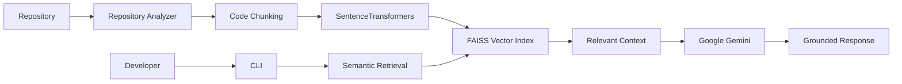

# RepoMind AI

> **AI-Powered Repository Intelligence Platform for Understanding Large Codebases**

RepoMind AI analyzes software repositories, builds semantic vector indexes using **SentenceTransformers** and **FAISS**, and enables developers to search, understand, document, and reason about codebases through **Retrieval-Augmented Generation (RAG)** powered by **Google Gemini**.

<p align="center">


\

</p>

---

## Table of Contents

* [Overview](#overview)
* [Features](#features)
* [Architecture](#architecture)
* [Repository Structure](#repository-structure)
* [Installation](#installation)
* [Configuration](#configuration)
* [CLI Usage](#cli-usage)
* [How It Works](#how-it-works)
* [Screenshots](#screenshots)
* [Workflow](#workflow)
* [Technology Stack](#technology-stack)
* [Performance Highlights](#performance-highlights)
* [Testing](#testing)
* [Continuous Integration](#continuous-integration)
* [Roadmap](#roadmap)
* [Contributing](#contributing)
* [License](#license)
* [Author](#author)

---

# Overview

Modern software repositories often contain hundreds or thousands of files, making onboarding, navigation, and documentation difficult.

RepoMind AI transforms a repository into an intelligent knowledge base by:

* Analyzing the source code
* Creating semantic embeddings
* Building a FAISS vector index
* Retrieving relevant code context
* Generating grounded answers using Google Gemini

Instead of relying on keyword matching, developers can search and ask questions using natural language while receiving responses backed by the actual repository.

---

# Features

| Capability               | Description                                                  |
| ------------------------ | ------------------------------------------------------------ |
| Repository Analysis      | Analyze repository structure and metadata                    |
| Repository Statistics    | Generate repository metrics and statistics                   |
| Semantic Search          | Search source code using semantic similarity                 |
| Vector Indexing          | Store embeddings with FAISS                                  |
| RAG Question Answering   | Answer repository-specific questions using retrieved context |
| Architecture Analysis    | Understand project architecture                              |
| Dependency Graph         | Generate repository dependency relationships                 |
| Documentation Generation | Produce repository documentation                             |
| Code Explanation         | Explain individual source files                              |
| Repository Reports       | Generate comprehensive repository reports                    |
| CLI Interface            | Lightweight command-line interface                           |
| Unit Testing             | Automated testing with Pytest                                |
| CI Pipeline              | GitHub Actions for continuous integration                    |

---

# Architecture



---

# Repository Structure

```text
RepoMind-AI/
│
├── src/
│   ├── cli.py
│   ├── core/
│   ├── config/
│   ├── embeddings/
│   ├── models/
│   ├── rag/
│   ├── services/
│   ├── utils/
│   └── vectorstore/
│
├── tests/
├── docs/
│   └── images/
├── .github/
│   └── workflows/
│
├── requirements.txt
├── pyproject.toml
├── README.md
└── .env.example
```

---

# Installation

## Clone the Repository

```bash
git clone https://github.com/USERNAME/RepoMind-AI.git

cd RepoMind-AI
```

## Create a Virtual Environment

### Windows

```bash
python -m venv .venv

.venv\Scripts\activate
```

### Linux / macOS

```bash
python3 -m venv .venv

source .venv/bin/activate
```

## Install Dependencies

```bash
pip install -r requirements.txt
```

---

# Configuration

Create a `.env` file in the project root.

```env
GOOGLE_API_KEY=your_google_gemini_api_key
```

---

# CLI Usage

| Command                                     | Purpose                    |
| ------------------------------------------- | -------------------------- |
| `python -m src.cli analyze .`               | Analyze repository         |
| `python -m src.cli ask "question"`          | Ask repository questions   |
| `python -m src.cli search "query"`          | Semantic search            |
| `python -m src.cli architecture .`          | Architecture analysis      |
| `python -m src.cli report .`                | Generate repository report |
| `python -m src.cli docs .`                  | Generate documentation     |
| `python -m src.cli explain path/to/file.py` | Explain source file        |
| `python -m src.cli stats .`                 | Repository statistics      |
| `python -m src.cli deps .`                  | Dependency graph           |
| `python -m src.cli map .`                   | Repository mapping         |

### Example Commands

```bash
python -m src.cli analyze .

python -m src.cli search "authentication middleware"

python -m src.cli ask "How is dependency injection implemented?"

python -m src.cli explain src/services/search_service.py

python -m src.cli report .
```

---

# How It Works

<details>
<summary><strong>Semantic Search</strong></summary>

Traditional code search depends on exact keywords.

RepoMind AI converts source code into dense vector embeddings using SentenceTransformers, enabling searches based on meaning rather than literal text.

For example, searching for:

```
authentication logic
```

can retrieve files containing concepts such as:

* JWT validation
* OAuth authentication
* Token verification
* Login middleware

even when those exact words are absent.

</details>

---

<details>
<summary><strong>Retrieval-Augmented Generation (RAG)</strong></summary>

The RAG pipeline combines semantic retrieval with Google Gemini.


Pipeline:

1. Analyze the repository.
2. Split source files into semantic chunks.
3. Generate vector embeddings.
4. Build a FAISS index.
5. Retrieve the most relevant context.
6. Send retrieved context to Google Gemini.
7. Generate a grounded, repository-aware response.

</details>

---

<details>
<summary><strong>FAISS Indexing</strong></summary>

FAISS enables efficient similarity search over vector embeddings.

```text
Repository
     │
     ▼
Code Chunking
     │
     ▼
SentenceTransformer
     │
     ▼
Embeddings
     │
     ▼
FAISS Index
     │
     ▼
Semantic Retrieval
```

Key advantages:

* Fast nearest-neighbor search
* Efficient indexing of large repositories
* Scalable semantic retrieval
* Low-latency vector search

</details>

---

# Screenshots

> Screenshots will be added as the project evolves.

| Feature                  | Placeholder                    |
| ------------------------ | ------------------------------ |
| Repository Analysis      | `docs/images/analyze.png`      |
| Semantic Search          | `docs/images/search.png`       |
| Architecture Analysis    | `docs/images/architecture.png` |
| Documentation Generation | `docs/images/docs.png`         |
| Repository Reports       | `docs/images/report.png`       |

---

# Workflow

```text
Analyze Repository
        │
        ▼
Generate Embeddings
        │
        ▼
Build FAISS Index
        │
        ▼
Semantic Search
        │
        ▼
Ask Questions
        │
        ▼
Generate Reports
```

---

# Technology Stack

| Technology           | Purpose                |
| -------------------- | ---------------------- |
| Python 3.11+         | Core application       |
| Google Gemini        | Large Language Model   |
| SentenceTransformers | Embedding generation   |
| FAISS                | Vector database        |
| Streamlit            | User interface         |
| Ruff                 | Linting                |
| Pytest               | Testing                |
| GitHub Actions       | Continuous Integration |

---

# Performance Highlights

* Semantic search over repository code using dense vector embeddings.
* High-performance similarity search with FAISS.
* Context-aware answers using Retrieval-Augmented Generation.
* Modular architecture designed for extensibility.
* CLI-first workflow for developer productivity.

---

# Testing

Run all tests:

```bash
pytest
```

Run with verbose output:

```bash
pytest -v
```

---

# Continuous Integration

The GitHub Actions workflow automatically performs:

* Dependency installation
* Ruff linting
* Unit test execution
* Build validation

The pipeline runs on every push and pull request to maintain code quality.

---

# Roadmap

* [ ] Interactive Streamlit dashboard
* [ ] Multi-repository indexing
* [ ] Incremental indexing
* [ ] Repository visualization
* [ ] Pull request intelligence
* [ ] Git history analysis
* [ ] REST API
* [ ] Docker support
* [ ] Cloud deployment

---

# Contributing

Contributions are welcome.

1. Fork the repository.
2. Create a feature branch.
3. Commit your changes.
4. Push your branch.
5. Open a Pull Request.

Before submitting:

* Ensure all tests pass.
* Run Ruff linting.
* Add tests for new functionality.
* Update documentation where applicable.

---

# License

This project is licensed under the **MIT License**.

Replace this section if a different license is used.

---

# Author

**Maitreyee Kulkarni**

Open Source Enthusiast

If you find this project useful, consider giving it a ⭐ on GitHub.
