# RepoMind AI Architecture

## Repository Structure

{'repository': 'RepoMind-AI', 'files': 34, 'python_files': 34, 'layers': {'root': ['app.py'], 'src': ['src\\cli.py', 'src\\__init__.py', 'src\\core\\config.py', 'src\\core\\constants.py', 'src\\core\\logger.py', 'src\\loaders\\git_loader.py', 'src\\loaders\\zip_loader.py', 'src\\models\\repository.py', 'src\\models\\repository_file.py', 'src\\models\\statistics.py', 'src\\parsers\\repository_parser.py', 'src\\services\\ai_service.py', 'src\\services\\architecture_service.py', 'src\\services\\code_graph_service.py', 'src\\services\\dependency_service.py', 'src\\services\\documentation_service.py', 'src\\services\\embedding_service.py', 'src\\services\\explain_service.py', 'src\\services\\rag_pipeline.py', 'src\\services\\rag_service.py', 'src\\services\\report_service.py', 'src\\services\\repository_intelligence.py', 'src\\services\\repository_service.py', 'src\\services\\retrieval_service.py', 'src\\services\\review_service.py', 'src\\services\\search_service.py', 'src\\services\\stats_service.py', 'src\\utils\\chunking.py', 'src\\utils\\file_utils.py', 'src\\utils\\language_detector.py', 'src\\vectorstore\\faiss_store.py', 'src\\visualization\\dependency_graph.py', 'src\\visualization\\mermaid_generator.py']}, 'classes': [{'name': 'Settings', 'file': 'src\\core\\config.py'}, {'name': 'LoggerManager', 'file': 'src\\core\\logger.py'}, {'name': 'GitRepositoryLoader', 'file': 'src\\loaders\\git_loader.py'}, {'name': 'ZipRepositoryLoader', 'file': 'src\\loaders\\zip_loader.py'}, {'name': 'RepositoryStatus', 'file': 'src\\models\\repository.py'}, {'name': 'RepositoryType', 'file': 'src\\models\\repository.py'}, {'name': 'Repository', 'file': 'src\\models\\repository.py'}, {'name': 'Config', 'file': 'src\\models\\repository.py'}, {'name': 'RepositoryFile', 'file': 'src\\models\\repository_file.py'}, {'name': 'LanguageStatistics', 'file': 'src\\models\\statistics.py'}, {'name': 'RepositoryStatistics', 'file': 'src\\models\\statistics.py'}, {'name': 'RepositoryParser', 'file': 'src\\parsers\\repository_parser.py'}, {'name': 'AIService', 'file': 'src\\services\\ai_service.py'}, {'name': 'ArchitectureService', 'file': 'src\\services\\architecture_service.py'}, {'name': 'CodeGraphService', 'file': 'src\\services\\code_graph_service.py'}, {'name': 'DependencyService', 'file': 'src\\services\\dependency_service.py'}, {'name': 'DocumentationService', 'file': 'src\\services\\documentation_service.py'}, {'name': 'EmbeddingService', 'file': 'src\\services\\embedding_service.py'}, {'name': 'ExplainService', 'file': 'src\\services\\explain_service.py'}, {'name': 'RAGPipeline', 'file': 'src\\services\\rag_pipeline.py'}, {'name': 'RAGService', 'file': 'src\\services\\rag_service.py'}, {'name': 'ReportService', 'file': 'src\\services\\report_service.py'}, {'name': 'RepositoryIntelligence', 'file': 'src\\services\\repository_intelligence.py'}, {'name': 'RepositoryService', 'file': 'src\\services\\repository_service.py'}, {'name': 'RetrievalService', 'file': 'src\\services\\retrieval_service.py'}, {'name': 'ReviewService', 'file': 'src\\services\\review_service.py'}, {'name': 'SearchService', 'file': 'src\\services\\search_service.py'}, {'name': 'StatsService', 'file': 'src\\services\\stats_service.py'}, {'name': 'DocumentChunk', 'file': 'src\\utils\\chunking.py'}, {'name': 'TextChunker', 'file': 'src\\utils\\chunking.py'}, {'name': 'LanguageDetector', 'file': 'src\\utils\\language_detector.py'}, {'name': 'FAISSVectorStore', 'file': 'src\\vectorstore\\faiss_store.py'}, {'name': 'DependencyGraph', 'file': 'src\\visualization\\dependency_graph.py'}, {'name': 'MermaidGenerator', 'file': 'src\\visualization\\mermaid_generator.py'}], 'functions': [{'name': 'configure_page', 'file': 'app.py'}, {'name': 'render_sidebar', 'file': 'app.py'}, {'name': 'render_dashboard', 'file': 'app.py'}, {'name': 'render_placeholder', 'file': 'app.py'}, {'name': 'main', 'file': 'app.py'}, {'name': 'analyze_repository', 'file': 'src\\cli.py'}, {'name': 'ask_repository', 'file': 'src\\cli.py'}, {'name': 'map_repository', 'file': 'src\\cli.py'}, {'name': 'architecture_repository', 'file': 'src\\cli.py'}, {'name': 'report_repository', 'file': 'src\\cli.py'}, {'name': 'docs_repository', 'file': 'src\\cli.py'}, {'name': 'explain_file', 'file': 'src\\cli.py'}, {'name': 'review_repository', 'file': 'src\\cli.py'}, {'name': 'stats_repository', 'file': 'src\\cli.py'}, {'name': 'deps_repository', 'file': 'src\\cli.py'}, {'name': 'search_repository', 'file': 'src\\cli.py'}, {'name': 'main', 'file': 'src\\cli.py'}, {'name': 'get_settings', 'file': 'src\\core\\config.py'}, {'name': 'initialize_directories', 'file': 'src\\core\\config.py'}, {'name': 'get_logger', 'file': 'src\\core\\logger.py'}, {'name': 'configure', 'file': 'src\\core\\logger.py'}, {'name': '__init__', 'file': 'src\\loaders\\git_loader.py'}, {'name': 'clone', 'file': 'src\\loaders\\git_loader.py'}, {'name': 'validate_repository', 'file': 'src\\loaders\\git_loader.py'}, {'name': '__init__', 'file': 'src\\loaders\\zip_loader.py'}, {'name': 'extract', 'file': 'src\\loaders\\zip_loader.py'}, {'name': '_safe_extract', 'file': 'src\\loaders\\zip_loader.py'}, {'name': 'update_status', 'file': 'src\\models\\repository.py'}, {'name': 'mark_indexed', 'file': 'src\\models\\repository_file.py'}, {'name': 'update_metadata', 'file': 'src\\models\\repository_file.py'}, {'name': 'add_language', 'file': 'src\\models\\statistics.py'}, {'name': 'update_health_score', 'file': 'src\\models\\statistics.py'}, {'name': 'parse', 'file': 'src\\parsers\\repository_parser.py'}, {'name': '_discover_files', 'file': 'src\\parsers\\repository_parser.py'}, {'name': '_create_repository_file', 'file': 'src\\parsers\\repository_parser.py'}, {'name': '_hash_content', 'file': 'src\\parsers\\repository_parser.py'}, {'name': '__init__', 'file': 'src\\services\\ai_service.py'}, {'name': 'ask', 'file': 'src\\services\\ai_service.py'}, {'name': 'local_reasoning', 'file': 'src\\services\\ai_service.py'}, {'name': '__init__', 'file': 'src\\services\\architecture_service.py'}, {'name': 'should_ignore', 'file': 'src\\services\\architecture_service.py'}, {'name': 'analyze_structure', 'file': 'src\\services\\architecture_service.py'}, {'name': 'generate_architecture_summary', 'file': 'src\\services\\architecture_service.py'}, {'name': 'create_component_graph_data', 'file': 'src\\services\\architecture_service.py'}, {'name': '__init__', 'file': 'src\\services\\code_graph_service.py'}, {'name': 'generate_graph', 'file': 'src\\services\\code_graph_service.py'}, {'name': 'generate_mermaid', 'file': 'src\\services\\code_graph_service.py'}, {'name': '__init__', 'file': 'src\\services\\dependency_service.py'}, {'name': 'analyze', 'file': 'src\\services\\dependency_service.py'}, {'name': '__init__', 'file': 'src\\services\\documentation_service.py'}, {'name': 'generate', 'file': 'src\\services\\documentation_service.py'}, {'name': 'create_architecture_doc', 'file': 'src\\services\\documentation_service.py'}, {'name': 'create_modules_doc', 'file': 'src\\services\\documentation_service.py'}, {'name': '__init__', 'file': 'src\\services\\embedding_service.py'}, {'name': 'embed_text', 'file': 'src\\services\\embedding_service.py'}, {'name': 'embed_chunks', 'file': 'src\\services\\embedding_service.py'}, {'name': 'explain', 'file': 'src\\services\\explain_service.py'}, {'name': '__init__', 'file': 'src\\services\\rag_pipeline.py'}, {'name': 'ask', 'file': 'src\\services\\rag_pipeline.py'}, {'name': 'analyze_repository', 'file': 'src\\services\\rag_pipeline.py'}, {'name': '__init__', 'file': 'src\\services\\rag_service.py'}, {'name': 'ask', 'file': 'src\\services\\rag_service.py'}, {'name': '__init__', 'file': 'src\\services\\report_service.py'}, {'name': 'generate_report', 'file': 'src\\services\\report_service.py'}, {'name': '__init__', 'file': 'src\\services\\repository_intelligence.py'}, {'name': 'analyze', 'file': 'src\\services\\repository_intelligence.py'}, {'name': '__init__', 'file': 'src\\services\\repository_service.py'}, {'name': 'validate_repository', 'file': 'src\\services\\repository_service.py'}, {'name': 'analyze_repository', 'file': 'src\\services\\repository_service.py'}, {'name': '__init__', 'file': 'src\\services\\retrieval_service.py'}, {'name': 'retrieve', 'file': 'src\\services\\retrieval_service.py'}, {'name': '__init__', 'file': 'src\\services\\review_service.py'}, {'name': 'generate_review', 'file': 'src\\services\\review_service.py'}, {'name': '_calculate_health_score', 'file': 'src\\services\\review_service.py'}, {'name': '_review_code_quality', 'file': 'src\\services\\review_service.py'}, {'name': '_review_security', 'file': 'src\\services\\review_service.py'}, {'name': '_review_performance', 'file': 'src\\services\\review_service.py'}, {'name': '__init__', 'file': 'src\\services\\search_service.py'}, {'name': 'search', 'file': 'src\\services\\search_service.py'}, {'name': '__init__', 'file': 'src\\services\\stats_service.py'}, {'name': 'generate_statistics', 'file': 'src\\services\\stats_service.py'}, {'name': '_count_lines', 'file': 'src\\services\\stats_service.py'}, {'name': '_analyze_python_file', 'file': 'src\\services\\stats_service.py'}, {'name': '_detect_language', 'file': 'src\\services\\stats_service.py'}, {'name': '__init__', 'file': 'src\\utils\\chunking.py'}, {'name': 'split_text', 'file': 'src\\utils\\chunking.py'}, {'name': 'discover_files', 'file': 'src\\utils\\file_utils.py'}, {'name': 'get_file_extension', 'file': 'src\\utils\\file_utils.py'}, {'name': 'detect', 'file': 'src\\utils\\language_detector.py'}, {'name': 'is_supported', 'file': 'src\\utils\\language_detector.py'}, {'name': '__init__', 'file': 'src\\vectorstore\\faiss_store.py'}, {'name': 'add_embeddings', 'file': 'src\\vectorstore\\faiss_store.py'}, {'name': 'save', 'file': 'src\\vectorstore\\faiss_store.py'}, {'name': 'search', 'file': 'src\\vectorstore\\faiss_store.py'}, {'name': '__init__', 'file': 'src\\visualization\\dependency_graph.py'}, {'name': 'add_component', 'file': 'src\\visualization\\dependency_graph.py'}, {'name': 'add_dependency', 'file': 'src\\visualization\\dependency_graph.py'}, {'name': 'build_from_structure', 'file': 'src\\visualization\\dependency_graph.py'}, {'name': 'get_graph_data', 'file': 'src\\visualization\\dependency_graph.py'}, {'name': 'get_statistics', 'file': 'src\\visualization\\dependency_graph.py'}, {'name': 'reset', 'file': 'src\\visualization\\dependency_graph.py'}, {'name': '__init__', 'file': 'src\\visualization\\mermaid_generator.py'}, {'name': 'generate_architecture_diagram', 'file': 'src\\visualization\\mermaid_generator.py'}, {'name': 'generate_component_diagram', 'file': 'src\\visualization\\mermaid_generator.py'}]}

## Dependency Graph

```mermaid
graph TD
app --> src.core.config
app --> src.core.logger
src.cli --> src.services.architecture_service
src.cli --> src.services.code_graph_service
src.cli --> src.services.dependency_service
src.cli --> src.services.documentation_service
src.cli --> src.services.explain_service
src.cli --> src.services.rag_service
src.cli --> src.services.report_service
src.cli --> src.services.repository_intelligence
src.cli --> src.services.review_service
src.cli --> src.services.search_service
src.cli --> src.services.stats_service
src.core.config --> src.core.constants
src.core.logger --> src.core.config
src.core.logger --> src.core.constants
src.legacy.repository_parser --> src.utils.chunking
src.legacy.repository_parser --> src.utils.file_utils
src.legacy.repository_parser --> src.utils.language_detector
src.loaders.git_loader --> src.core.config
src.loaders.git_loader --> src.core.logger
src.loaders.git_loader --> src.models.repository
src.loaders.git_loader --> src.models.repository_file
src.loaders.zip_loader --> src.core.config
src.loaders.zip_loader --> src.core.constants
src.loaders.zip_loader --> src.core.logger
src.loaders.zip_loader --> src.models.repository
src.loaders.zip_loader --> src.models.repository_file
src.parsers.repository_parser --> src.core.logger
src.parsers.repository_parser --> src.models.repository
src.parsers.repository_parser --> src.models.repository_file
src.services.ai_service --> src.core.config
src.services.ai_service --> src.core.logger
src.services.architecture_service --> src.core.logger
src.services.code_graph_service --> src.core.logger
src.services.dependency_service --> src.core.logger
src.services.documentation_service --> src.core.logger
src.services.documentation_service --> src.services.architecture_service
src.services.documentation_service --> src.services.code_graph_service
src.services.embedding_service --> src.core.config
src.services.embedding_service --> src.core.logger
src.services.embedding_service --> src.utils.chunking
src.services.explain_service --> src.core.logger
src.services.rag_pipeline --> src.core.logger
src.services.rag_pipeline --> src.services.ai_service
src.services.rag_pipeline --> src.services.retrieval_service
src.services.rag_service --> src.core.logger
src.services.rag_service --> src.services.ai_service
src.services.rag_service --> src.services.retrieval_service
src.services.report_service --> src.core.logger
src.services.report_service --> src.services.architecture_service
src.services.report_service --> src.services.code_graph_service
src.services.repository_intelligence --> src.core.logger
src.services.repository_intelligence --> src.services.embedding_service
src.services.repository_intelligence --> src.utils.chunking
src.services.repository_intelligence --> src.utils.file_utils
src.services.repository_intelligence --> src.vectorstore.faiss_store
src.services.repository_service --> src.core.logger
src.services.repository_service --> src.models.repository
src.services.repository_service --> src.models.repository_file
src.services.repository_service --> src.parsers.repository_parser
src.services.retrieval_service --> src.core.logger
src.services.retrieval_service --> src.services.embedding_service
src.services.retrieval_service --> src.vectorstore.faiss_store
src.services.review_service --> src.core.logger
src.services.search_service --> src.core.logger
src.services.search_service --> src.services.retrieval_service
src.services.stats_service --> src.core.logger
src.services.stats_service --> src.utils.file_utils
src.utils.chunking --> src.core.logger
src.utils.language_detector --> src.core.logger
src.vectorstore.faiss_store --> src.core.logger
src.visualization.dependency_graph --> src.core.logger
src.visualization.mermaid_generator --> src.core.logger
tests.test_embedding_service --> src.services.embedding_service
```

Generated by RepoMind AI
